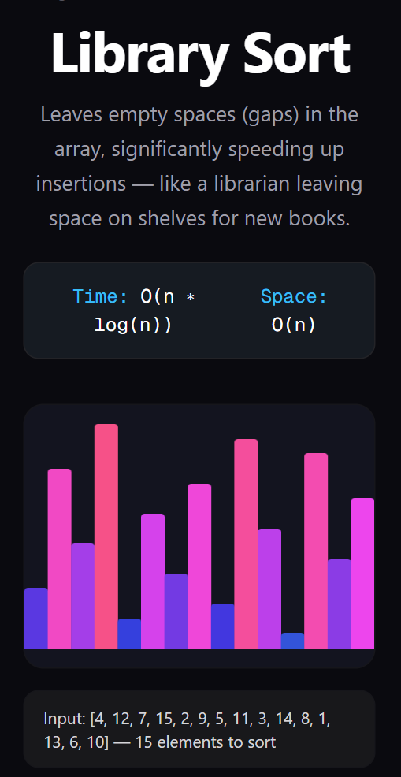

# AlgoViz — Interactive Algorithm Learning Platform

> A professional, world-class platform for visualising and learning algorithms step-by-step — built with Next.js 16, React 19, GSAP, and TypeScript.



---

## Overview

AlgoViz transforms abstract algorithms into living, breathing visualisations. Every step of every algorithm is rendered in real time — bars animate into their correct positions as the logic executes, while a synchronised code viewer highlights the exact lines being run. Variables, descriptions, and playback controls keep you oriented at every moment.

The goal is simple: **make algorithms intuitive, not intimidating.**

---

## Features

### Visualisation Engine
- **GSAP-powered bar chart** — all elements are visible at all times; bars smoothly fly to their sorted positions as each step executes
- **Collision-free slot assignment** — a mathematically guaranteed unique horizontal slot for every bar at every step (no two elements ever share a position)
- **Value-proportional heights** — bar heights scale to their actual values so relative magnitudes are always clear
- **Value-based colour gradient** — bars transition from deep blue (low values) through purple to hot pink (high values)
- **Active element highlight** — the bar currently being inserted glows bright red-pink with a soft radial shadow

### Synchronised Code Viewer
- **Line-by-line execution tracking** — the active code range is highlighted in green as the algorithm advances
- **VS Code–style tab header** — language badge, filename, and close tab for a familiar IDE feel
- **Scrollable, full-height panel** — the entire algorithm is readable at a glance on larger screens

### Playback Controls
- **Play / Pause / Step Forward / Step Back / Reset**
- **Speed control** — 0.5×, 1×, 1.5×, 2×, 3×
- **Scrubber** — jump to any step instantly
- **Keyboard shortcuts** — `Space` to play/pause, `←` / `→` to step

### Layout
- **Responsive two-column layout on large screens** — code viewer pinned on the left, animated bar chart on the right — both visible simultaneously
- **Single-column stacked layout on mobile**

### Variables Panel
- Live display of all algorithm variables at the current step (e.g. `val`, `pos`, `round`, `insPos`)

---

## Tech Stack

| Layer | Technology |
|---|---|
| Framework | [Next.js 16](https://nextjs.org/) (App Router, Turbopack) |
| UI Library | [React 19](https://react.dev/) |
| Animation | [GSAP 3](https://gsap.com/) |
| Syntax Highlighting | [prism-react-renderer](https://github.com/FormidableLabs/prism-react-renderer) |
| Styling | [Tailwind CSS v4](https://tailwindcss.com/) |
| Language | [TypeScript 5](https://www.typescriptlang.org/) |

---

## Architecture

```
algorithms/
├── algorithms/
│   └── library-sort/
│       ├── algorithm.ts     # Generator function — yields AlgorithmStep on every operation
│       └── code.ts          # Source code string displayed in the code viewer
├── app/
│   ├── page.tsx             # Algorithm index / home page
│   ├── layout.tsx           # Root layout (Geist font, dark theme)
│   └── algorithms/
│       └── library-sort/
│           └── page.tsx     # Library Sort page — wires generator → AlgorithmPlayer
├── components/
│   ├── algorithm-player/    # Top-level orchestrator (layout, keyboard shortcuts)
│   ├── code-viewer/         # Syntax-highlighted code panel with green line highlighting
│   ├── controls/            # Playback controls (play, pause, step, speed, scrubber)
│   ├── variables-panel/     # Live variable display
│   └── visualization/
│       └── bar-viz.tsx      # GSAP-animated bar chart with collision-free slot algorithm
└── lib/
    ├── types.ts             # AlgorithmStep, CodeRange, AlgorithmMetadata interfaces
    └── use-algorithm-player.ts  # Custom hook — step collection, playback state machine
```

### How an Algorithm is Added

Every algorithm is a **TypeScript generator function** that `yield`s an `AlgorithmStep` at each meaningful operation:

```typescript
export function* librarySortGenerator(
  input: number[] = DEFAULT_INPUT
): Generator<AlgorithmStep<LibrarySortData>, void, unknown> {

  yield createStep("pick_value", { array: S, input, insertingValue: val },
    `Pick next element: ${val}`,
    { start: 13, end: 15 },
    { variables: { val, pos, round } }
  );

  // ... more yields per operation
}
```

The `useAlgorithmPlayer` hook eagerly collects all steps into an array on mount, enabling instant scrubbing to any position without re-running the generator.

### Collision-Free Slot Assignment

The visualisation guarantees no two bars ever share a horizontal slot:

1. **Placed bars** are permanently assigned their final sorted rank (e.g. value `4` in a 15-element array always occupies slot `3`).
2. **Unplaced bars** are distributed — in original input order — across the remaining free slots.

This means at every step the `n` slots are partitioned between placed and unplaced bars with zero overlap, and the end state is always a perfect ascending bar chart.

---

## Getting Started

### Prerequisites
- Node.js ≥ 18
- npm ≥ 9

### Installation

```bash
git clone https://github.com/AlexDjangoX/algorithms.git
cd algorithms
npm install
```

### Development

```bash
npm run dev
```

Open [http://localhost:3000](http://localhost:3000).

### Production Build

```bash
npm run build
npm start
```

---

## Algorithms

| Algorithm | Category | Time Complexity | Space Complexity | Status |
|---|---|---|---|---|
| Library Sort | Sorting | O(n · log n) | O(n) | ✅ Live |
| Bubble Sort | Sorting | O(n²) | O(1) | 🔜 Planned |
| Merge Sort | Sorting | O(n · log n) | O(n) | 🔜 Planned |
| Quick Sort | Sorting | O(n · log n) avg | O(log n) | 🔜 Planned |
| Binary Search | Searching | O(log n) | O(1) | 🔜 Planned |
| A\* Pathfinding | Graph | O(E · log V) | O(V) | 🔜 Planned |

---

## Keyboard Shortcuts

| Key | Action |
|---|---|
| `Space` | Play / Pause |
| `→` | Step forward one operation |
| `←` | Step back one operation |

---

## Contributing

Adding a new algorithm requires three files:

1. **`algorithms/<name>/algorithm.ts`** — the generator function that yields `AlgorithmStep` objects
2. **`algorithms/<name>/code.ts`** — the source code string shown in the viewer
3. **`app/algorithms/<name>/page.tsx`** — the Next.js page that wires the generator into `<AlgorithmPlayer>`

The visualisation, controls, code viewer, and variables panel are fully generic — they require no changes to support a new algorithm.

---

## License

MIT
